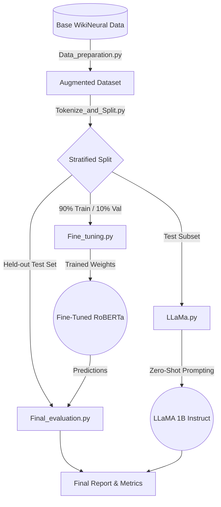

<div align="center">
  <h1>🛡️ PII Detection and Masking</h1>
  <p><strong>A Comparative Study: Fine-Tuned RoBERTa vs. Zero-Shot LLaMA 1B</strong></p>
  
  
  
  
</div>

---

## 📖 Overview

Detecting Personal Identifiable Information (PII) is a critical step in modern data privacy and security workflows. This project focuses on identifying **Person Names (`PER`)** and **Email Addresses (`EMAIL`)** in text.

We utilized the **WikiNeural** dataset, augmented with synthetically injected email addresses, to test the boundary-span detection capabilities of two distinct AI approaches:
1. A fine-tuned **`roberta-base`** token classification model.
2. A zero-shot **`meta-llama/Llama-3.2-1B-Instruct`** large language model.

> [!IMPORTANT]
> **Key Conclusion:** For production-level PII detection, fine-tuned token classification models currently remain vastly superior to zero-shot LLMs in terms of accuracy, boundary precision, speed, and resource efficiency.

---

## 🏆 Key Findings

* 🥇 **Fine-Tuned RoBERTa** achieved a **0.95 F1 score** for email detection and a **0.93 F1 score** for person name detection.
* 📉 **Zero-Shot LLaMA 1B** struggled significantly without task-specific constraints, managing only a **0.42 F1 score** for email detection.
* ⚠️ **Hallucination Issue**: LLaMA 1B suffered from a severe hallucination rate, inventing fake emails in **41.8%** of cases where no email existed in the text.

---

## ⚙️ System Architecture & Pipeline

The workflow is divided into five distinct stages, meant to be run sequentially:



### 📁 File Descriptions
1. 🛠️ **`Data_preparation.py`**: Augments the base WikiNeural dataset by generating realistic email addresses from person names. Injects these emails into 15% of the entries using normal and "spaced" formatting to prevent data leakage.
2. ✂️ **`Tokenize_and_Split.py`**: Performs a stratified split to preserve email distribution. Tokenizes text using `RobertaTokenizerFast`, propagating the `I-EMAIL` label to RoBERTa sub-tokens to ensure proper learning of multi-token email addresses.
3. 🧠 **`Fine_tuning.py`**: Fine-tunes the `roberta-base` model for token classification. Optimized for a 16GB T4 GPU using FP16, gradient accumulation, and gradient checkpointing.
4. 🤖 **`LLaMa.py`**: Evaluates `Llama-3.2-1B-Instruct` in zero-shot mode on a 325-example test subset, identifying names and emails using a pure instruction-based prompt.
5. 📊 **`Final_evaluation.py`**: Loads the best RoBERTa checkpoint and evaluates it against the held-out test set, computing span-level metrics (seqeval), token-level FPR/FNR, and conducting error analysis.

---

## 📈 Performance Comparison

| Metric | RoBERTa (Fine-Tuned) | LLaMA 1B (Zero-Shot) | Delta |
| :--- | :--- | :--- | :--- |
| **PER F1** | `0.9307` | `0.8529` | **+0.0778** |
| **EMAIL F1** | `0.9492` | `0.4183` | **+0.5309** |
| **Hallucinations** | `0` | `136/325 (41.8%)` | — |

> [!NOTE]
> Detailed insights, including False Positive (FP) and False Negative (FN) analysis, can be found in the included [`Report.pdf`](./Report.pdf).

---

## 🚀 Setup & Installation

**1. Clone the repository:**
```bash
git clone https://github.com/Arsalan692/PII-Detection-and-Masking.git
cd PII-Detection-and-Masking
```

**2. Install Dependencies:**
Ensure you have the required Python libraries installed:
```bash
pip install transformers datasets seqeval scikit-learn torch huggingface_hub python-dotenv
```

**3. Hugging Face Authentication (For LLaMA):**
If you plan to run the `LLaMa.py` zero-shot script, you must authenticate with Hugging Face:
* Create a `.env` file in the root directory of the project.
* Add your generated Hugging Face access token to the file:
```env
HUGGING_FACE_TOKEN="your_hugging_face_token_here"
```
*(The `.gitignore` file is configured to ensure this file is never pushed to the repository).*
